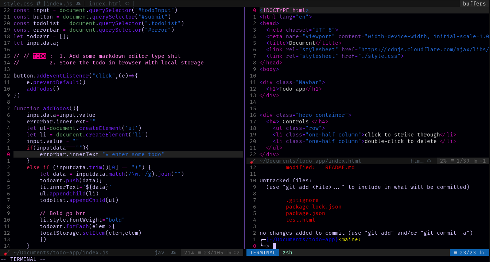

# dadara 
A dark colorscheme for vim and nvim inspired by [pop-punk][https://github.com/bignimbus/pop-punk.vim]

## Installing 
You can either download repo or use plugin manager that you like. I personally use vim-plug:

    Plug 'ps173/dadara'

## ScreenShot

## Note 
If you use airline or lightline then the theme will not be supported.
You can use any other airline or lightline theme.
